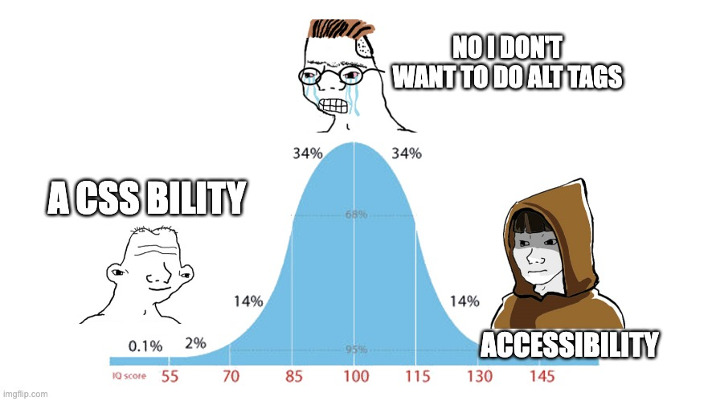

# Cursed Books
This project was intended as a sort of meme project, centered on Ayn Rand. However, to make it actually useful, we did our best to make the project as unacessible as possible while still usable, as an example of how hard it is to use websites when they are not accessible. Someone could still use this, but if they're visually impaired or use screen readers, they would have an incredibly hard time using this website, due to its features:

* The alt tags are in SHA256, so if they cannot see the image, they would not be able to know what the images are (Not even Satan could think of this one).
* The contrast on colours is bad, so they are hard to distinguish from even if you are not visually impaired.
* The tab indexing is all ~~fucked up~~, which means someone who is using voiceover or something like that, or has difficulty using a mouse, would have problems going around the app.
* The videos and music don't have controls, so if someone needs to put the volume down, they need to put their system volume down

*P.S. there is a stable branch which is actually usable* 
